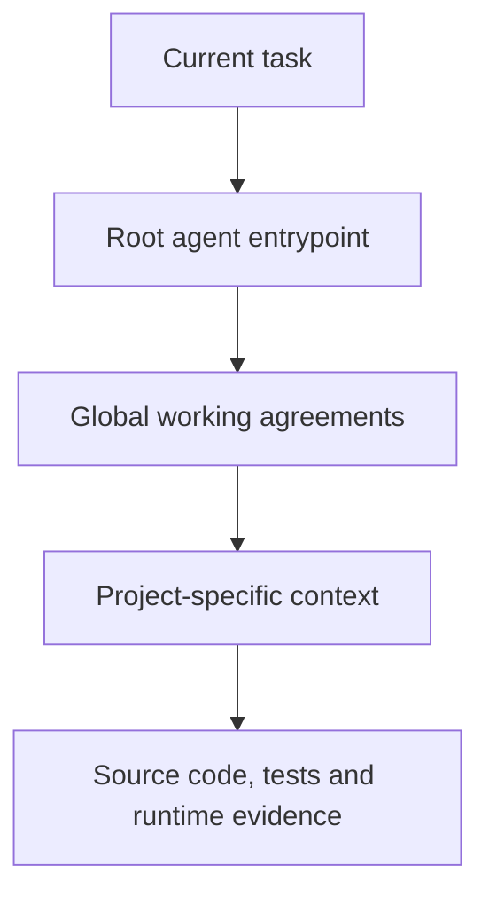

# Agentic Ground Rules

> Let AI do the work without giving up developer control.

Agentic Ground Rules is a practical, human-readable and model-agnostic framework for giving coding agents durable project instructions.

The repository demonstrates how to replace scattered persona prompts, repeated chat explanations and vendor-specific instruction files with one version-controlled source of truth.

This is an opinionated reference implementation, not a rigid standard. Copy what helps, change what does not, and keep the result aligned with the project developers actually maintain.

## The core idea

An agent should not have to reconstruct the project from chat history or guess what "work like a senior developer" means.

Give it an explicit instruction chain instead:



The current task defines the desired change. Global files define reusable engineering expectations. Project files explain the real system. Source code, tests and runtime observations verify what is actually true.

## Design principles

| Principle | Meaning |
| --- | --- |
| Human-readable | Developers can review the same rules the agent receives. |
| Model-agnostic | The knowledge lives in ordinary Markdown instead of one vendor's prompt format. |
| Layered | Global rules are inherited; project folders add only local context and exceptions. |
| Evidence-driven | Current code and runtime results outrank stale documentation and chat memory. |
| DRY | A rule has one natural home and is referenced instead of copied. |
| Version-controlled | Instruction changes are reviewed like other engineering changes. |
| Proportional | Small projects use a small document set; complex systems document more. |

## Repository structure

```text
.
├─ AGENTS.md                         Canonical agent entrypoint
├─ CLAUDE.md                         Thin compatibility adapter
├─ GEMINI.md                         Thin compatibility adapter
├─ global/                           Project-independent working agreements
│  ├─ assistant-contract.md
│  ├─ response-style.md
│  ├─ workflow.md
│  ├─ architecture.md
│  ├─ coding-style.md
│  ├─ security.md
│  └─ git-workflow.md
└─ projects/
   ├─ general-project-commands/      Flexible template and intake checklist
   ├─ example-java-api/              Small backend example
   ├─ example-react-frontend/        Frontend and external API example
   └─ example-fullstack-platform/    Multi-repository production example
```

## Start here

1. Read [`global/README.md`](global/README.md) and adapt the shared rules to your organization or personal workflow.
2. Use [`projects/general-project-commands/project-intake.md`](projects/general-project-commands/project-intake.md) to inspect the real project before documenting it.
3. Create `projects/<project-name>/` with only the files that project needs.
4. Replace every placeholder and remove guidance text from the finished project folder.
5. Add thin adapter files for the agents your team uses. Keep the actual rules in one place.
6. Test the setup by asking the agent which instruction sources it loaded and what it believes the current project boundaries are.

For a new agent session using a separate instruction repository, a useful starting message is:

```text
Read the instruction repository first.
Load global/ and projects/<project-name>/.
Then inspect the source repository named in the project README before proposing changes.
```

An external link alone does not guarantee that an agent can read another repository. Make the instruction repository available in the same workspace or explicitly provide access to it.

## Why the adapter files are small

`AGENTS.md` is the canonical entrypoint in this repository. Nested `AGENTS.md` files provide local routing close to the context they govern. This follows [Codex's documented root-to-working-directory instruction discovery model](https://learn.chatgpt.com/docs/agent-configuration/agents-md).

`CLAUDE.md` and `GEMINI.md` deliberately contain almost no policy. They route compatible tools to the same hierarchy instead of creating three copies that slowly drift apart.

Other agents can use the same Markdown files when they are configured or explicitly instructed to load them.

## The examples

The example projects are fictional and intentionally different:

| Example | Demonstrates |
| --- | --- |
| `example-java-api` | A small project that needs only a compact instruction package. |
| `example-react-frontend` | Frontend state, API boundaries, accessibility and client-side security limits. |
| `example-fullstack-platform` | Multiple repositories, deployment differences, asynchronous workflows and stronger handover needs. |

They are examples of structure and writing style, not architectures that every project must copy.

## What this framework does not replace

- source-code inspection
- tests, CI and code review
- threat modelling and security controls
- architecture decision records
- observability and production evidence
- a developer's responsibility for the final change

Instructions improve context and consistency. They do not grant an agent authority it did not already have, and they do not turn an unverified assumption into a fact.

## Contributing

See [`CONTRIBUTING.md`](CONTRIBUTING.md). Keep examples fictional and never submit employer, customer or private project information without authorization.

## License

Except where otherwise noted, this repository is licensed under the [Creative Commons Attribution 4.0 International License](LICENSE).

Copyright © 2026 Cristhian Gertner. See [`ATTRIBUTION.md`](ATTRIBUTION.md) for a ready-to-use attribution statement.
