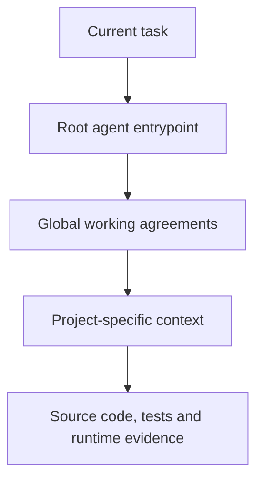

# Agentic Ground Rules: AGENTS.md templates for AI coding agents

> Let AI do the work without giving up developer control.

Agentic Ground Rules is a practical, human-readable and model-agnostic framework for giving AI coding agents durable project instructions.

Use it with OpenAI Codex, Claude Code, Gemini CLI and other agents that can load Markdown instructions. It replaces scattered persona prompts, repeated chat explanations and vendor-specific policy copies with one version-controlled source of truth.

This is an opinionated reference implementation, not a rigid standard. Copy what helps, change what does not, and keep the result aligned with the projects developers actually maintain. The agent should adapt to the project; the project does not need to imitate the template.

## Why this saves so much time

The expensive part of AI-assisted development is not generating lines of code. It is repeatedly explaining the architecture, rediscovering old decisions, correcting style drift and cleaning up code that was placed in the wrong layer.

Agentic Ground Rules turns that repeated work into reusable project infrastructure. Architecture, naming, build commands, testing expectations, security boundaries and known pitfalls are described once, reviewed by humans and loaded again in future agent sessions. The cumulative time saving across features, bug fixes and handovers can be enormous.

More importantly, the framework helps generated code follow the same engineering standards the team has used for years across different projects. MVC boundaries, DRY rules, repository patterns, naming conventions and project-specific exceptions stop living only in experienced developers' heads or old chat sessions.

The result should feel familiar:

| Work | Without durable instructions | With Agentic Ground Rules |
| --- | --- | --- |
| Start a new agent session | Repeat the same project explanation | Load version-controlled context |
| Add a feature | Let the agent guess where code belongs | Follow the project's real architecture and conventions |
| Fix a defect | Rediscover ownership, history and pitfalls | Start in the owning layer with known constraints |
| Review generated code | Correct avoidable structure and style drift | Review code that already resembles the existing codebase |
| Return to the project later | Reconstruct decisions from memory and chat history | Read the same durable context used by developers and agents |

Familiar structure makes code easier to read, debug, extend and review. A developer should be able to open the project months later and quickly see where controllers, models, interfaces, repositories, helpers, database connectors and integrations belong.

## The core idea

An agent should not have to reconstruct the project from chat history or guess what "work like a senior developer" means.

Give it an explicit instruction chain instead:



The current task defines the desired change. Global files define reusable engineering expectations. Project files explain the real system and its intentional differences. Source code, tests and runtime observations verify what is actually true.

## A practical example

Imagine a team maintaining an existing Java and Spring Boot order API. The next task is to add order cancellation.

The shared instructions already establish that controllers stay thin, business rules belong in services or use cases, persistence belongs in repositories, and shared semantics follow DRY. The project folder then adds concrete facts such as:

```text
projects/order-api/
├─ AGENTS.md
├─ README.md
├─ architecture.md
├─ current-status.md
└─ pitfalls.md
```

Its project instructions might say:

```text
Source repository: acme/orders-api
Architecture: OrderController -> CancelOrderService -> OrderRepository
Business rule: OrderCancellationPolicy is the single owner of cancellation eligibility
Verification: ./mvnw test
Known pitfall: an OrderCancelled event must be published only once
```

The developer can then give the agent a focused task:

```text
Read the instruction repository first.
Load global/ and projects/order-api/.
Then inspect the source repository and add order cancellation without changing
the existing API response format.
```

Before changing code, the agent now knows where to start and what must remain true. It can inspect the actual source, reuse `OrderCancellationPolicy` instead of duplicating eligibility checks, keep the controller focused on transport, place persistence changes in the repository layer and test the event behaviour explicitly.

The framework does not prescribe an arbitrary number of files. It makes responsibility boundaries visible so the smallest complete change ends up in the right places. In React, C#, PHP, Python or another language, folder and framework names may differ while the same separation of responsibilities remains recognizable.

That is the practical payoff: less repeated prompting, less cleanup and code that still looks as though it belongs to the project.

## Repository structure

```text
.
├─ AGENTS.md                         Canonical agent entrypoint
├─ CLAUDE.md                         Thin compatibility adapter
├─ GEMINI.md                         Thin compatibility adapter
├─ global/                           Project-independent working agreements
│  ├─ assistant-contract.md
│  ├─ response-style.md
│  ├─ workflow.md
│  ├─ architecture.md
│  ├─ coding-style.md
│  ├─ security.md
│  └─ git-workflow.md
└─ projects/
   ├─ general-project-commands/      Flexible template and intake checklist
   ├─ example-java-api/              Small backend example
   ├─ example-react-frontend/        Frontend and external API example
   └─ example-fullstack-platform/    Multi-repository production example
```

## Quick start

1. Create a repository from this template or copy the framework into a dedicated instruction repository.
2. Read [`global/README.md`](global/README.md) and adapt the shared rules to your organization or personal workflow.
3. Use [`projects/general-project-commands/project-intake.md`](projects/general-project-commands/project-intake.md) to inspect the real project before documenting it.
4. Create `projects/<project-name>/` with only the files that project needs.
5. Replace every placeholder and remove guidance text from the finished project folder.
6. Add thin adapter files for the agents your team uses. Keep the actual rules in one place.
7. Test the setup by asking the agent which instruction sources it loaded and what it believes the current project boundaries are.

For a new agent session using a separate instruction repository, a useful starting message is:

```text
Read the instruction repository first.
Load global/ and projects/<project-name>/.
Then inspect the source repository named in the project README before proposing changes.
```

An external link alone does not guarantee that an agent can read another repository. Make the instruction repository available in the same workspace or explicitly provide access to it.

## Design principles

| Principle | Meaning |
| --- | --- |
| Human-readable | Developers can review the same rules the agent receives. |
| Model-agnostic | The knowledge lives in ordinary Markdown instead of one vendor's prompt format. |
| Layered | Global rules are inherited; project folders add only local context and exceptions. |
| Evidence-driven | Current code and runtime results outrank stale documentation and chat memory. |
| DRY | A rule has one natural home and is referenced instead of copied. |
| Version-controlled | Instruction changes are reviewed like other engineering changes. |
| Proportional | Small projects use a small document set; complex systems document more. |

## Why the adapter files are small

`AGENTS.md` is the canonical entrypoint in this repository. Nested `AGENTS.md` files provide local routing close to the context they govern. This follows [Codex's documented root-to-working-directory instruction discovery model](https://learn.chatgpt.com/docs/agent-configuration/agents-md).

`CLAUDE.md` and `GEMINI.md` deliberately contain almost no policy. They route compatible tools to the same hierarchy instead of creating three copies that slowly drift apart.

Other agents can use the same Markdown files when they are configured or explicitly instructed to load them.

## The examples

The example projects are fictional and intentionally different:

| Example | Demonstrates |
| --- | --- |
| `example-java-api` | A small project that needs only a compact instruction package. |
| `example-react-frontend` | Frontend state, API boundaries, accessibility and client-side security limits. |
| `example-fullstack-platform` | Multiple repositories, deployment differences, asynchronous workflows and stronger handover needs. |

They are examples of structure and writing style, not architectures that every project must copy.

## What this framework does not replace

- source-code inspection
- tests, CI and code review
- threat modelling and security controls
- architecture decision records
- observability and production evidence
- a developer's responsibility for the final change

Instructions improve context and consistency. They do not grant an agent authority it did not already have, and they do not turn an unverified assumption into a fact.

## Help others find it

If this framework saves you time, consider starring the repository so other developers can discover it too.

## Contributing

See [`CONTRIBUTING.md`](CONTRIBUTING.md). Keep examples fictional and never submit employer, customer or private project information without authorization.

## License

Except where otherwise noted, this repository is licensed under the [Creative Commons Attribution 4.0 International License](LICENSE).

Copyright © 2026 Cristhian Gertner. See [`ATTRIBUTION.md`](ATTRIBUTION.md) for a ready-to-use attribution statement.
